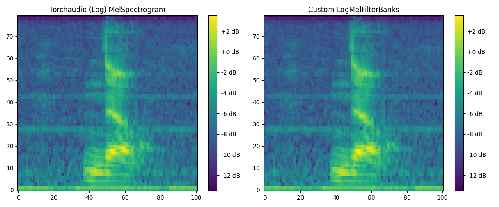
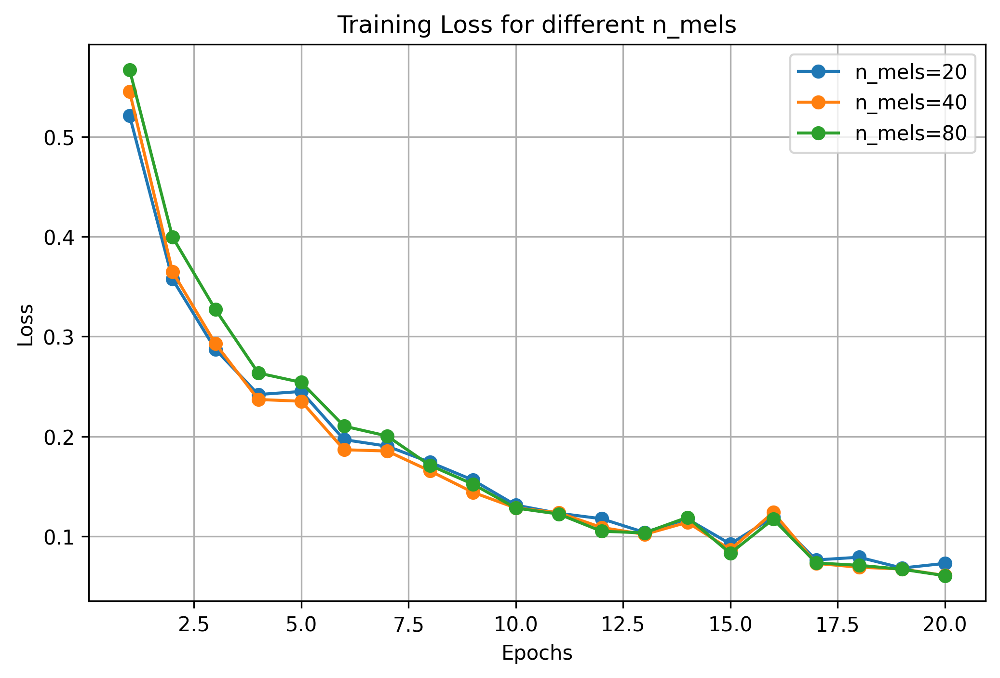
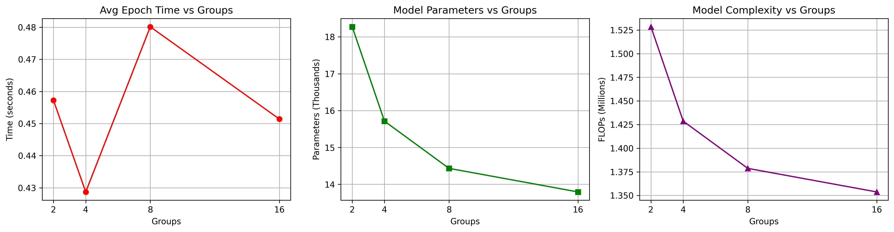

# Assignment 1. Digital Signal Processing

# Part 1 — LogMelFilterBanks

Чтобы повторить логарифмический мелфильтрбанк своими руками, делаем те же четыре шага:

- Получаем спектрограмму через `torch.stft` с hann-окном:

```python
spec = self.spectrogram(x)
```

- Переводим в мощность:

```python
power_spec = spec.abs().pow(self.power)
```

- Перемножаем power-спектр на melscale-банки (берём их у `F.melscale_fbanks`):

```python
mel_spec = torch.matmul(power_spec.transpose(1, 2), self.mel_fbanks).transpose(1, 2)
```

- Логарифмируем:

```python
log_mel_spec = torch.log(mel_spec + 1e-6)
```

Дальше сравним свой `LogMelFilterBanks` с `torchaudio.transforms.MelSpectrogram`:

```python
signal, sr, *_ = dataset[0]

melspec = torchaudio.transforms.MelSpectrogram(
    sample_rate=sr, n_fft=400, hop_length=160, n_mels=80,
    center=True, pad_mode="reflect", power=2.0, norm=None, mel_scale="htk",
)(signal)

logmelbanks = LogMelFilterBanks(
    n_fft=400, samplerate=sr, hop_length=160, n_mels=80,
    center=True, pad_mode="reflect", power=2.0, norm_mel=None, mel_scale="htk",
)(signal)
```



_Спектрограммы идентичны_ — и на глаз, и через `assert torch.allclose(...)` (atol=1e-4 на всякий случай):

```python
assert torch.log(melspec + 1e-6).shape == logmelbanks.shape
assert torch.allclose(torch.log(melspec + 1e-6), logmelbanks, atol=1e-4)
```

## Part 2

План тот же: собрать CNN, прогнать по разным `n_mels` с `groups=1`, выбрать лучший и на нём поэкспериментировать с `groups` (жадный алгоритм, как и в референсе).

Архитектура состоит из нескольких `Conv1d` (kernel=5, stride=2, padding=2):
- Conv1d (n_mels → 32) + BatchNorm + ReLU
- Conv1d (32 → 32) + BatchNorm + ReLU
- Conv1d (32 → 32) + BatchNorm + ReLU
- mean по времени → Linear(32, 2)

Параметров ~18.5K при `n_mels=80` — сильно меньше потолка в 100K. Считаю их и FLOPs через `thop`. Обучаю 20 эпох на `n_mels ∈ {20, 40, 80}` с `groups=1`:



Кривые train loss близкие, к 20-й эпохе все три варианта сходятся в район 0.06–0.08. `n_mels=20` и `n_mels=40` идут почти вровень, `n_mels=80` медленнее на старте (фичей больше). По идее для бинарной yes/no задачи 20 каналов хватает с головой, остальное — избыток.

Фиксирую `n_mels=80` как baseline (хочется протестить на более «жирном» варианте, чтобы эффект от групп был заметнее) и гоняю `groups ∈ {2, 4, 8, 16}`, по 5 эпох на каждом:



# Conclusion

Параметры и FLOPs падают монотонно с ростом `groups` — с 18.5K параметров до 13.5K и с 1.53M FLOPs до 1.35M. Это и ожидалось: группы делят каналы и режут количество умножений.

Время эпохи скачет немонотонно (groups=4 — быстрее, groups=8 — снова дольше). Думаю, это шум измерения: модель маленькая, эпоха короткая, никакого прогрева я не делал, так что разница между запусками сравнима с самим временем эпохи. На большой модели тренд должен прорезаться нормально — там FLOPs реально доминируют над накладными расходами.

Круто, что групповая свёртка ужимает модель почти на 30% по параметрам и на ~12% по FLOPs, а качество не разваливается. Для деплоя на слабое железо топчик.
